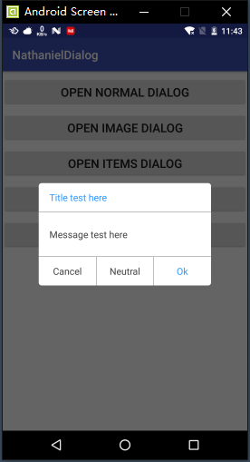
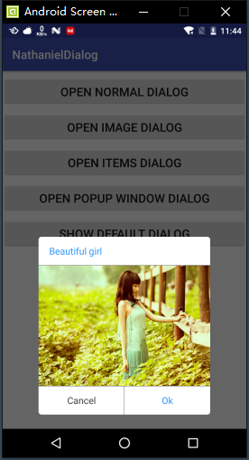
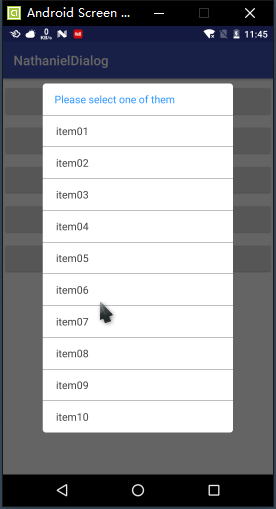
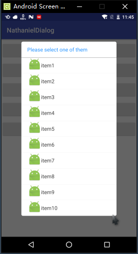
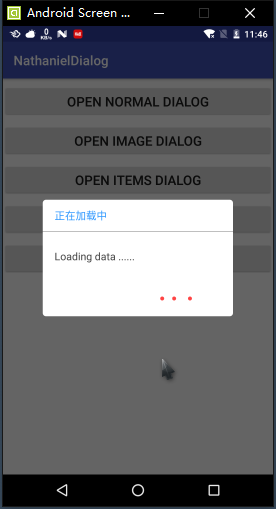

# 关于我 #
    本人是一只小菜鸟，这是本人持续更新的一个开源控件，从2016.04开始第一个版本。
    因在工作中使用AlertDialog时，因ROM和OS版本不同导致样式不统一，所以就动手写了这个自定义的Dialog。
    因这些都是自己在工作中遇到的需要的功能，所以只是我需要的功能，不能满足所有的需求，如有需要，请自行添加。
    如果你在改代码之后，请发给我一份，谢谢。
    Email：nathanwriting@126.com

# NathanielDialog说明

## 截图 ##

## 使用 ##
compile 'com.yumore:Dialog:1.1.3'

## Version 1.1.2 ##
    【新增】 Builder setMaxLines(int maxLines)
        设置弹出EditText 的行数，EditText会随着行数变化高度

## Version 1.1.1 ##
    【修复】 设置自定义宽高失效的bug 

## Version 1.1.0 ##
    【新增】 1. setEditable(boolean editable) 
                true ：带有EditText 的 Dialog
                nathanielDialog.getEditText() 获取EditText 的内容
            2. setHint(int resId)
            3. setHint(CharSequence hint) 

## Version 1.0.9 ##
    【修改】 1. public Builder setContentView(View customView, boolean needClear)
            改为 public Builder setCustomView(View customView, boolean needClear)
            2. public Builder setContentView(View customView, boolean needClear， boolean clearAll)
            改为 public Builder setCustomView(View customView, boolean needClear, boolean clearAll)
    【新增】 public Builder setOnKeyListener(OnKeyListener onKeyListener); 方法

## Version 1.0.8 ##
    【新增】 setContentView(View view, boolean needClear, boolean clearAll);
            原来setContentView(View view, boolean neeadClear) 只清除title以外的view，新增是否清除所有

## Version 1.0.7 ##
    【新增】将代码分为 Library 和 Sample
    【优化】部分代码
    【新增】Progress显示

## Version 1.0.6 ##
    【修改】将原有的setContentView(View view)该为setContentView(View view, boolean needClear)
    needClear   true：清除所有的布局，默认的布局全部清除
                false：将自定义的View替换内容区域，可以设置title，negativeButton，positiveButton，items等

## Version 1.0.5 ##
    【新增】以下接口：
        1)setGravity(int gravity); // 设置Dialog显示在屏幕的位置
        2)setLayoutParams(LayoutParams layoutParmas); // 给Dialog设置布局样式
        3)setLayoutParamsOffset(DialogOffset dialogOffset); // 给Dalog设置布局样式的偏移量
    【说明】将Gradle版本升级到3.3

## Version 1.0.4 ##
    【新增】setItems(List<String> strings, OnItemClickListener onItemClickListener);
    【修改】 1) setItems(int resId, OnClickListener onClickListener)
            为 setItems(int resId, OnItemClickListener onItemClickListener)
            2) setItems(CharSequence[] items, OnClickListener onClickListener)
            为 setItems(CharSequence[] items, OnItemClickListener onItemClickListener)
    【说明】将Gradle版本升级到3.2 Android Studio 的版本升级到2.2.3

## Version 1.0.3 ##
    【新增】setOnDismissListener(OnDismissListener onDismissListener); // Dialog在Dismiss时的回调

## Version 1.0.2 ##
    【新增】setContentView(View view); // 填充自定义的View
    【新增】弹出带图片的Dialog，可以是网络图片，也可以是Bitmap对象

## Version 1.0.1 ##
    1.新增弹出图片
    2.新增弹出带icon的item
    3.优化部分代码

## Version 1.0.0
    和AlertDialog一样使用
    new NathanielDialog.Builder(this)
        .setTitle("Beautiful girl")
        .setMessage("This is a butiful gril.")
        .setPositiveButton("Ok", null)
        .setNegativeButton("Cancel", null)
        .setCancelable(true)
        .create()
        .show();
